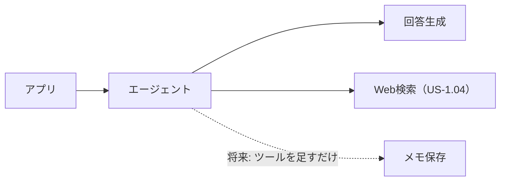

<!-- AI instruction (pinned): User stories are written as 「〜として、〜したい。〜だから」 (who / what / why).
IDs are US-<priority>.<2-digit serial> (P0=1, P1=2, P2 is undecided and uses X). Never renumber: other documents refer to these IDs.
Implementation concerns (e.g. "multi-user support") are not stories; put them in §5.
Describe only the current state, no history. Keep reasons, implementation notes and measurements in the appendices (補足) at the end. -->

# 要件定義（ユーザーストーリー）

このアプリが「誰の、どんな困りごとを、どう解決するか」を定める。
技術の方針（[01](01_technical_policies.md)）より上位にあり、設計で迷ったらここに立ち返る。

## 1. 誰のためのアプリか

バイクでツーリングをするライダー。当面は開発者本人ひとり。

| 特徴 | 設計への影響 |
|---|---|
| 走行中は手が使えない | 画面操作を前提にできない |
| 走行中は画面を見られない | 回答は読み上げる。Markdown 等の記号は害になる |
| ヘルメット内は騒がしい | インカム（イヤホン＋マイク）を前提にする |
| 移動し続けている | 「今どこにいるか」が刻々と変わる |
| 一人で走っている | 話し相手がいない |

## 2. 何に困っているか

走っていると、気になるものが次々に現れるが、確かめる手段がない。

- 「右手に見えるあの山、何ていう山だろう」
- 「この先で給油できるところある？」
- 「この地域って何が有名なんだろう」

停まってスマホで調べれば分かる。しかし停まりたくないし、走行中は触れない。結果、気になったまま流れていく。

> 核心は「調べ物ができない」ことではなく、**その瞬間に、その場所で、聞けない**こと。

## 3. コアとなる体験

```
ライダー「（インカムのボタンを押す）右手に見える山は何？（もう一度押す）」
アプリ  「愛鷹山です。富士山の南東にある火山で…」

ライダー「へえ。この先で給油できる？」      ← 続けて聞ける
アプリ  「5km先の国道沿いにスタンドがあります」  ← 自分で調べて答える
```

1. 手も目も使わずに聞ける
2. 今いる場所と進行方向を踏まえて答える
3. 続けて質問できる
4. AI が自分で調べて答える（「アプリで検索して」と言わない）

## 4. ユーザーストーリー

P0 = MVP / P1 = 音声化 / X = 将来（優先度未定）。ID は `US-<優先度>.<連番>` で、連番は詰め直さない。

### P0：MVP

| ID | ストーリー | 受け入れ条件 |
|---|---|---|
| **US-1.01** | ライダーとして、今いる場所を踏まえて AI に質問したい。その土地のことを知りたいから | 現在地が回答に反映される |
| **US-1.02** | ライダーとして、続けて質問したい。一問一答では会話にならないから | 指示語（「それ」）が前の質問を受けて解釈される |
| **US-1.03** | ライダーとして、スマホアプリから使いたい。バイクに積むのはスマホだから | 実機（Android）で動作する |
| **US-1.04** | ライダーとして、AI に自分で調べて答えてほしい。「アプリで検索して」と言われても走行中はできないから | 「調べられません」で終わらず、調べた上で答える |
| **US-1.05** | ライダーとして、会話を明示的に区切りたい。話題が変わったのに前の文脈を引きずられたくないから | 会話をリセットする操作があり、以降の質問に前の文脈が影響しない |

### P1：音声化

| ID | ストーリー | 備考 |
|---|---|---|
| **US-2.01** | ライダーとして、声で質問したい。走行中は入力できないから | STT |
| **US-2.02** | ライダーとして、声で回答を聞きたい。走行中は読めないから | TTS |
| **US-2.03** | ライダーとして、進行方向を踏まえてほしい。「右手に見える山」と聞きたいから | GPS の2点から方位を算出する |
| **US-2.04** | ライダーとして、スマホに触れずに起動したい。走行中の画面操作は法律上できないから | インカムのボタンで起動する（補足C） |

### X：将来（優先度未定）

| ID | ストーリー | 備考 |
|---|---|---|
| **US-X.01** | ライダーとして、気になった場所をメモに残したい。後で見返したいから | 今は作らないが、作れる構造にしておく（補足B） |
| **US-X.02** | ライダーとして、走った道の記録を残したい。振り返りたいから | US-X.01 と同系統 |

## 5. やらないこと

| やらないこと | 理由 |
|---|---|
| iOS 対応 | 当面は Android だけで足りる |
| ナビゲーション機能 | 既存のナビアプリと併用する前提 |
| 15分以上あけた会話の継続 | 連続して聞くときに繋がればよい |
| 凝った UI | 動作確認に足る最小限。価値は AWS 側にある |
| 複数ユーザー対応 | アプリを配ることとは別物。配布はするが、利用者ごとのアカウント・認証は作らない。API キーは全員が同じものを手で入れる |
| 一般公開（Play の本番リリース） | 知人に配れれば足りるので、内部テストに留める |

## 6. 成功の判定

MVP（P0）:

- [x] 実機のスマホアプリから、現在地とともに質問を送れる
- [x] AI が現在地を踏まえた回答を返す（現在地が正確であることを実機で確認）
- [x] 続けて質問すると、前の会話を踏まえて答える
- [x] 「今日の天気は？」に、AI が自分で調べて答える
- [x] 会話をリセットすると、前の文脈が引き継がれない

P1:

- [x] 声で質問し、声で回答が返る（US-2.01/2.02）
- [x] 進行方向を踏まえて答える（US-2.03）
- [x] スマホに触れずに一巡できる（US-2.04。インカムのボタン → 起動 → 録音 → もう一度押して送信 → 読み上げ → ナビのアプリへ戻る、を実機で確認）
- [ ] 走りながら、上記が通しでできる

## 7. 未確定事項

- [ ] 走行中の騒音下で、インカムのマイクで録った音声の STT がどこまで実用になるか（停車中は実用）
- [ ] コストが現実的な範囲に収まるか

---

## 補足A：なぜ Web 検索（US-1.04）が MVP に必要か

検索なし（LLM の知識のみ）で答えられるかを実測した。

| 質問 | 回答 | 判定 |
|---|---|---|
| 道の駅は？ | 「富士川楽座があります」 | ○ |
| 絶景スポットは？ | 「田子の浦みなと公園」 | ○ |
| ガソリンスタンドは？ | 「Googleマップで検索するのが確実です」 | × |
| 今日のイベントは？ | 「リアルタイムの情報にアクセスできません」 | × |
| 今日の天気は？ | 「天気予報アプリで確認してください」 | × |

「アプリで確認してください」は走行中のライダーには実行できず、手も目も使えないという前提（§1）を回答そのものが裏切る。
有名な観光地の話なら検索なしでも成立するが、「今この瞬間・この場所」の情報（給油・天気・イベント・営業状況）には検索が要る。

## 補足B：メモ機能（US-X.01）への備え

メモ機能は将来必要だが、今は作らない。代わりに、エージェントにツールを足すだけで後から入れられる構造を保つ。



## 補足C：US-2.04「触れずに起動」の許容範囲

要件は「スマホに触れないこと」であって、「声で呼ぶこと」ではない。
走行中の画面操作は法律上できない（道路交通法）ので、「アプリを開いて押す」は解にならない。その条件さえ満たせば手段は問わない。

| 手段 | 可否 |
|---|---|
| インカムのボタン | ○ 採る。ハンドルから手を離さずに押せる |
| ウェイクワード | × 常時マイクを占有する |
| 画面のボタン | × 法律上できない |

同じ理屈で「話し終えた」もインカムのボタンで示してよい。押すのはスマホではなくインカムなので、2回押しても要件は満たし、起動と同じボタンなので操作も一貫する。

インカムのボタンを押すと Android が `ACTION_VOICE_COMMAND` を発行し、本アプリがそれを受けて起動する。
端末の既定のデジタルアシスタントは Google のままでよく、Google アシスタントもマップの音声入力も残る。
