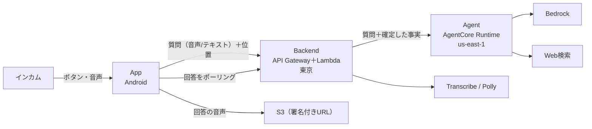

# 技術方針

プロジェクト全体に効く技術の方針と選定。要件は [00_user_stories.md](00_user_stories.md)、各ユニットの責務は [02_units_definition.md](02_units_definition.md)、ユニット間の約束は [03_units_contracts.md](03_units_contracts.md)。

## 1. 概要

走行中は画面を見られず、手も使えない。この前提で、ライダーがインカムのボタンと声だけで AI と対話できるようにする。

アプリは薄いクライアントに徹し、賢い処理は AWS 側で行う。

- アプリの仕事: 起動を受ける・位置を取る・録音する・送る・回答を鳴らす
- AWS の仕事: 事実（住所・方位・日時）を確定する・文字にする・回答を考える・必要なら Web 検索する・読み上げの音声を作る

## 2. 全体構成

ユニット（App・Backend・Agent・CICD）の中の構成は、各ユニットの docs にある。

## 3. レイヤーの方針

### App

- 録音・再生・位置の取得・起動の経路（インカムのボタンからの起動、応答後にナビのアプリへ戻る）だけを持つ。ロジックは持たない。
- UI は動作確認に足る最小限。走行中に画面を見ない前提で、状態は音で知らせる。

### Backend

- 門番: 入力の検証・流量制限（API キー＋Usage Plan）・入力量の上限を、Bedrock を呼ぶ前に手前で行う。
- LLM に渡す前に事実を確定させる。座標から住所、2点から進行方位、現在日時を Backend が求め、プロンプトに添える。調べれば確定するものを LLM に推測させない（座標から場所を推測させると、約40km離れた市を答えた）。
- 音声: 録音を受けて STT（Transcribe）を呼び、回答の読み上げ（Polly）を作る。
- 回答は非同期で返す（API Gateway の29秒の上限を越えるため）。

### Agent

- 会話の保持・回答の生成・Web 検索を担う。
- 拡張はツール（`@tool`）を足す形で行う。メモ機能（US-X.01）は後から足せる構造を保つ。
- 会話の継続は「一問一答＋α」まで。セッションを越える記憶（AgentCore Memory）は持たない。

### CICD

- Agent と Backend のデプロイ、App の Play 内部テストへの配信を担う。Agent・Backend のデプロイの仕組みは公開側に書かない。

## 4. 技術選定

| 対象 | 採用 | 理由 |
|---|---|---|
| 対象 OS | Android | 開発者の端末。インカムの Intent を受ける仕組みが Android にある |
| App | React Native（Expo SDK 54）・Development Build | 既存の JS/TS の知識が活きる。ネイティブの機能を config plugin と自前のモジュールで足す |
| ハンズフリー起動 | `android.intent.action.VOICE_COMMAND` を Activity の intent-filter で受ける | インカムのボタンが発行する Intent。既定のアシスタントを奪わない |
| Backend | API Gateway ＋ Lambda（Python）・SAM | Lambda と API Gateway が中心の構成に素直 |
| Agent | Bedrock AgentCore（Strands）・CDK（`agentcore` CLI が生成） | セッション管理がネイティブで、Web 検索のコネクタがある |
| モデル | Claude Sonnet 4.6（`us.anthropic.claude-sonnet-4-6`） | 回答の質。リージョンに合わせた推論プロファイルを使う |
| STT / TTS | Amazon Transcribe（バッチ）/ Amazon Polly（`Kazuha`） | Lambda から呼べる。日本語の音声→音声モデルは無い |
| CI/CD | AWS CodeBuild（Agent・Backend）・GitHub Actions（App） | App を AWS に依存させない |

## 5. リージョン

| 対象 | リージョン | 理由 |
|---|---|---|
| Backend | `ap-northeast-1`（東京） | 利用者が日本にいる |
| Agent | `us-east-1`（バージニア） | Web 検索のコネクタ（AgentCore Gateway の組み込み）が us-east-1 限定。Runtime と Gateway を分けないため Agent ごと置く |

⚠️ リージョンを取り違えると動かない。東京の Lambda から us-east-1 の Runtime を呼ぶときは、クライアントのリージョンを明示する。

## 6. 実測に基づく前提

- エージェントの初回の応答は10秒前後（コールドスタート）、2回目以降は2〜3秒。アプリ側では縮められない。
- 回答までの時間は、テキストで10〜13秒、音声で15〜20秒（STT のぶん）。
- AgentCore はアイドル中も課金される（文脈を保つため）。

## 7. やらないこと

[00_user_stories.md](00_user_stories.md) §5。
