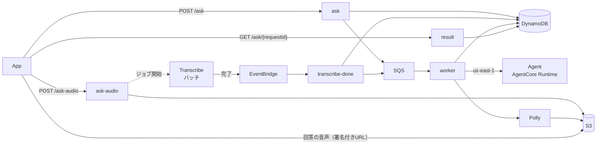

# Backend の設計

Backend は API の入口に立つ門番で、LLM に渡す前に事実を確定させる場所でもある。
全体の方針は [docs-parent/01_technical_policies.md](../docs-parent/01_technical_policies.md)、App・Agent との約束は [docs-parent/03_units_contracts.md](../docs-parent/03_units_contracts.md)（UC-2〜UC-5）。

- リージョン: `ap-northeast-1`（東京）。IaC は SAM（`template.yaml`）。
- 回答の生成・会話の記憶・Web 検索は Agent の担当で、Backend は LLM を直接呼ばない。

## 1. 構成

| Lambda | 経路 | 役割 |
|---|---|---|
| `ask` | `POST /ask` | テキストの質問を検証し、事実を確定してプロンプトを組み、キューに積む |
| `ask-audio` | `POST /ask-audio` | 音声を検証して S3 に置き、Transcribe のジョブを投げる |
| `transcribe-done` | EventBridge | 文字起こしの完了を受け、事実を確定してプロンプトを組み、キューに積む |
| `worker` | SQS | Agent を呼び、回答を DynamoDB に置き、Polly で読み上げの音声を作る |
| `result` | `GET /ask/{requestId}` | 状態と回答を返す。音声の署名付き URL を発行する |
| `health` | `GET /health` | 固定値を返す（API キー不要） |

非同期の仕組みは [02_async_ask.md](02_async_ask.md)、テーブルは [04_dynamodb_table.md](04_dynamodb_table.md)。

## 2. LLM に渡す前に事実を確定させる

調べれば確定するものを LLM に推測させない。プロンプトの形は契約（UC-5）。組み立ては `src/lib/prompt.py` で、テキスト（`ask`）と音声（`transcribe-done`）の両経路が同じ処理を呼ぶ（二重に持たない）。

| 事実 | 求め方 |
|---|---|
| 住所 | 座標から Amazon Location Service の逆ジオコーディングで求める（`handlers/geocode.py`）。LLM に座標から推測させると約40km離れた市を答えた。エージェントのツールにはしない（毎回必要な前提なので、呼ぶかどうかを LLM に判断させない） |
| 進行方位 | App が送る2点から算出する（[03_heading.md](03_heading.md)） |
| 現在日時 | 日本時間で分まで（`format_now`）。LLM は今日の日付を知らず、検索で得た新しい記事を未来の日付と取り違えるため。位置が無い質問にも付ける |
| 経過時間 | 会話の最初の質問から1分以上経っていれば添える（`format_elapsed`）。時刻どうしの引き算を LLM にさせない |

## 3. 音声の経路

App は録音して送るだけで、STT/TTS は Backend が呼ぶ。

- Transcribe はバッチ（`StartTranscriptionJob`）を使う。ストリーミングは双方向なので Lambda を経由できないが、喋りながら認識する必要は無い。
- バッチは非同期なので、ジョブを投げた時点では質問の中身が無い。座標はいったん DynamoDB に置き、完了（EventBridge の `Transcribe Job State Change`）を受けてから住所・方位を確定する。
- 完了後はテキストと同じ経路（SQS → worker）に合流する。ポーリングも `GET /ask/{requestId}` のまま。
- ⚠️ バッチにはジョブのキューイングがあり、所要時間は保証されない（同時実行の上限に達したときの話）。

### Transcribe 用の IAM ロール

文字起こしを書き出すのは、ジョブを開始した Lambda が終わった後なので、Lambda の権限は使えない。Transcribe が assume するロール（`role-trg-<env>-transcribe`）を `JobExecutionSettings.DataAccessRoleArn` で渡す。

- 出力先を指定しなければロールは不要だが、AWS 管理のバケットに置かれ、ライフサイクルで消すこともサポートケースなしに削除することもできない。文字起こしはライダーの発話そのものなので、自分のバケット（`transcripts/`）に置く。
- 信頼ポリシーには `aws:SourceAccount` / `aws:SourceArn` の条件を付ける（他アカウントからの踏み台化を防ぐ）。

### 回答の音声

| | |
|---|---|
| 生成 | worker が回答の直後に Polly を呼び、S3 に置く（要求されてから作ると初回の再生が遅れる） |
| 声 | `Kazuha`（女性・ニューラル）。`Mizuki` はスタンダードしか無いので選ばない |
| 渡し方 | result Lambda が署名付き URL を発行する（有効期限は数分）。ポーリングの応答にはテキストと URL だけを載せる |
| 保存 | S3 のライフサイクルで1日後に自動で消す（`AudioRetentionDays`。録音も同じ） |

テキストを先に返せ、ポーリングの応答が軽く（走行中は再試行が起きる）、音声は API Gateway と Lambda のサイズ上限に関係しない。
合成に失敗しても回答のテキストは返す（ハンズフリーのときは、App が本文を端末の音声で読み上げる）。

### 録音の形式

Transcribe の推奨は FLAC / WAV だが、Android の録音 API はどちらも直接出せない。重なるのが M4A（AAC）で、変換を挟まずに済む。
音声のペイロードは 2 MiB で弾き（`MAX_AUDIO_BYTES`）、録音の長さの上限を兼ねる（API Gateway の上限は 10MB）。

## 4. 悪用対策（多層防御）

URL が漏れれば誰でも叩けるので、単一の対策に頼らない。

| 層 | 対策 |
|---|---|
| 入口 | API キー必須（`/health` を除く） |
| 流量 | API Gateway の Usage Plan（日次クォータ・レート制限） |
| 入力量（テキスト） | 質問は500文字まで |
| 入力量（音声） | ペイロードは 2 MiB まで |
| 出力量 | Agent の `max_tokens` |

### 流量制限の値

値はデプロイ時のパラメータで変えられる。実際の使い方に基づく値ではなく、仮の値。

| パラメータ | 既定値 | 根拠 |
|---|---|---|
| `DailyQuota` | 2000回/日 | ポーリングを含む呼び出し回数。1問≒11回なので約180問/日 |
| `ThrottleRate` | 5回/秒 | ポーリングは最初の30秒間1秒間隔なので、1回/秒だと自分の質問が弾かれる |
| `ThrottleBurst` | 10回 | 前の質問のポーリング中に次を投げても通る程度 |

### API キー

- キーとUsage Plan はテンプレートに明示的に書く（SAM に任せると名前を指定できない）。名前は `apikey-trg-<env>-main`。
- ⚠️ キーの値はスタックの Outputs に出さない（出すのはキーの ID）。取り出し方は [README.md](../README.md)。
- `GET /health` はキー不要。「API が落ちているのか、キーが違うのか」の切り分けに使う。

## 5. Agent の呼び出し

呼び出しの形は契約（UC-5）。実装は `src/lib/agent.py`。

- Runtime は us-east-1 にあるので、`bedrock-agentcore` クライアントのリージョンを `AGENT_REGION` で明示する。
- Runtime の ARN は SSM（`/trg/<env>/agent-runtime-arn`）からデプロイ時に焼き込む（UC-3）。
- IAM は `bedrock-agentcore:InvokeAgentRuntime` を、Runtime の ARN とその配下（`/runtime-endpoint/*`）の両方に付ける（実際に呼ばれるのは後者）。
- `geo-places:ReverseGeocode` はリソース単位の ARN を持たないので `Resource: "*"`（アクション側で絞る）。
