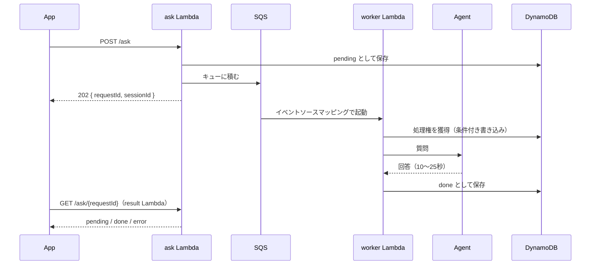
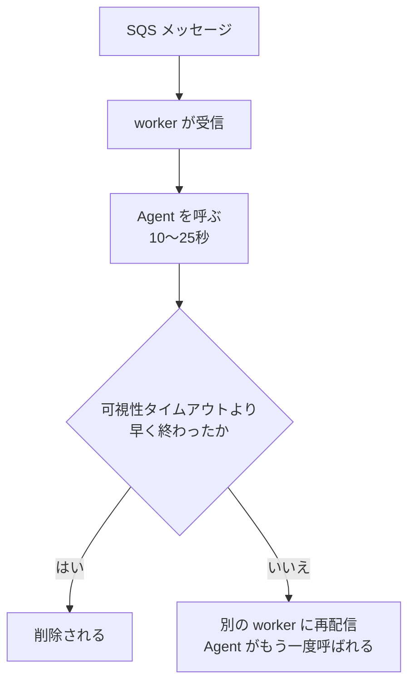
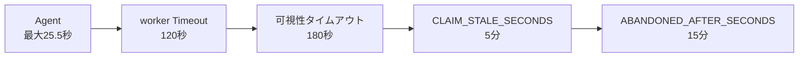

# 回答を非同期で返す

API Gateway は1リクエストを29秒で必ず切り、エージェントの生成は最悪25.5秒かかる（実測）。そのため回答はポーリングで返す。
API の形とポーリングの間隔・打ち切りは契約（[docs-parent/03_units_contracts.md](../docs-parent/03_units_contracts.md) UC-4）、データの持ち方は [04_dynamodb_table.md](04_dynamodb_table.md)。

## 1. 構成

「質問を受ける係」と「実際に考える係」を分ける。

- worker は API Gateway を経由しないので、29秒ではなく Lambda 自体の上限まで使える。
- ポーリングのたびに Agent を呼ぶとやり直しになり、最初の1回で呼ぶと29秒に当たる。呼びっぱなしにできる場所として worker を置く。
- Lambda から Lambda を直接呼ばず、SQS を挟む（滞留の可視化・DLQ）。

## 2. 二重処理を防ぐ

SQS は「少なくとも1回」配信するので、同じメッセージが2回届き得る。このアプリでは二重処理が Agent の二重呼び出し（二重課金）になる。

対策は2層。

| 対策 | 内容 |
|---|---|
| 時間の大小関係 | worker の Timeout（120秒）＜ キューの可視性タイムアウト（180秒） |
| 条件付き書き込み | worker は `pending → processing` を `ConditionExpression` で行う。2つ目は獲得に失敗し、Agent を呼ばずに終わる（`src/lib/store.py` の `claim()`） |

- ⚠️ worker の Timeout を伸ばすときは、可視性タイムアウトも一緒に伸ばす。崩れると処理中に再配信される。
- ⚠️ `CLAIM_STALE_SECONDS` は可視性タイムアウトより長くする。短いと、まだ動いている worker から奪って Agent を二重に呼ぶ。
- App のポーリングの打ち切り（120秒）はこの並びの外にあり、揃える必要は無い。App が諦めても処理は続き、結果は DynamoDB に残る。

取り残された `processing` の回収は [04_dynamodb_table.md](04_dynamodb_table.md) §4。

## 3. AWS リソース

| リソース | 名前 | 要点 |
|---|---|---|
| SQS | `sqs-trg-<env>-ask` | 可視性タイムアウト 180秒 |
| DLQ | `sqs-trg-<env>-ask-dlq` | 3回失敗で退避。14日保持 |
| DynamoDB | `dynamodb-trg-<env>-main` | [04_dynamodb_table.md](04_dynamodb_table.md) |
| worker | `lambda-trg-<env>-worker` | Timeout 120秒、バッチサイズ 1 |
| result | `lambda-trg-<env>-result` | `GET /ask/{requestId}` |

⚠️ バッチサイズは1にする。既定の10だと、1件10〜25秒かかる質問をまとめて受けて Timeout を超える。

## 4. 待ち時間

非同期化は速くする施策ではない。タイムアウトしなくなるだけで、待ち時間そのものは縮まらない。
回答までの時間はテキストで10〜13秒、音声で15〜20秒（文字起こしのぶん）。回答の長さは58〜173文字とばらつく。
