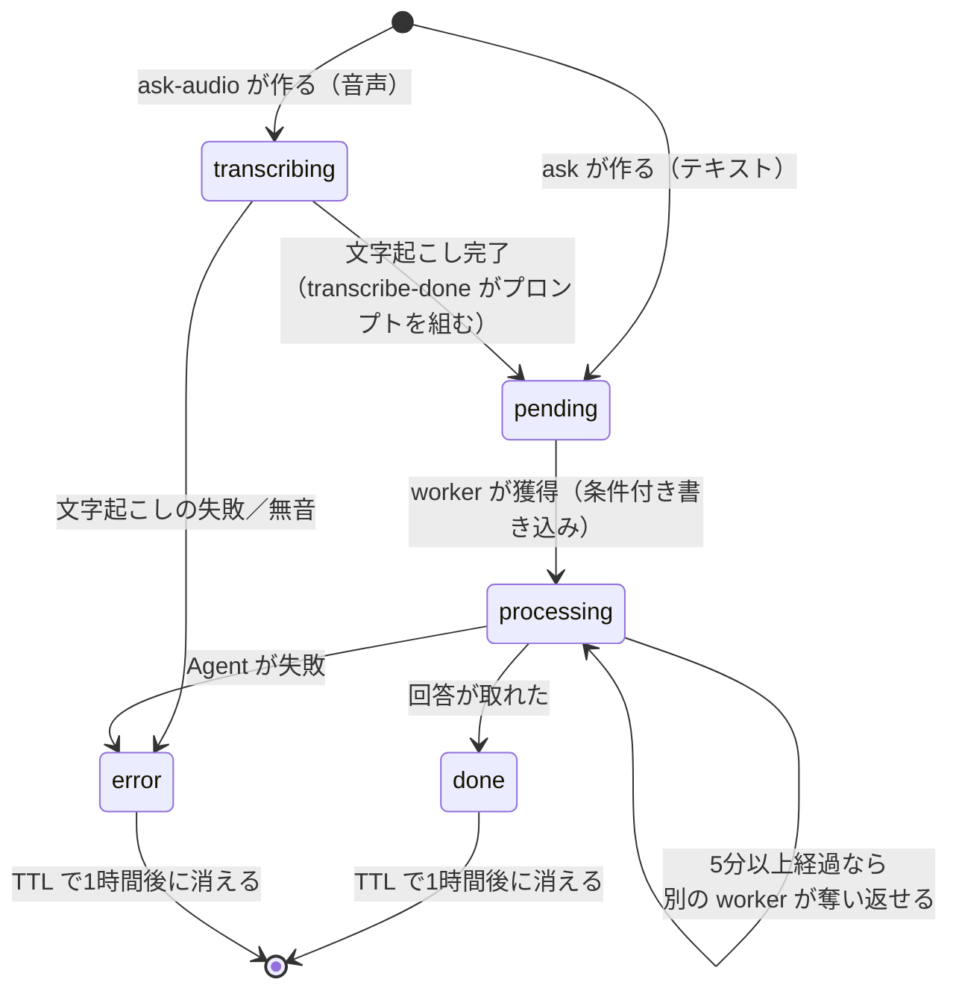

# DynamoDB テーブル定義

Backend が使う DynamoDB のテーブルは1つだけ。非同期の仕組みは [02_async_ask.md](02_async_ask.md)。

## 1. シングルテーブル設計

用途ごとにテーブルを増やさない。DynamoDB には JOIN が無く、1回のクエリで関連データをまとめて取れるのが強みで、テーブルを分けると容量設定・監視・IAM も増える。
1つのテーブルに複数種類のデータを混ぜ、種類は `pk` / `sk` の書き方で区別する。

## 2. テーブル

| 項目 | 値 |
|---|---|
| 物理名 | `dynamodb-trg-<env>-main` |
| パーティションキー | `pk`（文字列） |
| ソートキー | `sk`（文字列） |
| 課金モード | オンデマンド（ツーリング中の散発的な利用で、読み書きの量を見積もれない） |
| TTL 属性 | `expiresAt`（UNIX 秒） |

## 3. キーの設計

`pk` と `sk` の先頭にデータの種類を書く（`#` で区切る）。

| 種類 | `pk` | `sk` | 状態 |
|---|---|---|---|
| 質問の処理状況 | `ASK#<requestId>` | `STATUS` | 使用中（§4） |
| 会話ログ | `SESSION#<sessionId>` | `MSG#<ISO8601>` | 未実装（案） |
| メモ（US-X.01） | `MEMO#<userId>` | `MEMO#<ISO8601>` | 未実装（案） |

未実装の2つは、シングルテーブルなら後から足せることを示す案で、実際に作るときに見直す。

## 4. 質問の処理状況（ASK）

App が結果を取りに来るまでの一時的な置き場。

### 属性

| 属性 | 型 | 必須 | 説明 |
|---|---|---|---|
| `pk` | S | ○ | `ASK#<requestId>` |
| `sk` | S | ○ | `STATUS`（固定） |
| `status` | S | ○ | `transcribing` / `pending` / `processing` / `done` / `error` |
| `sessionId` | S | ○ | 会話 ID。回答と一緒に App へ返す |
| `location` | M | | 音声の質問だけ。`transcribing` の間だけ持つ座標（下記） |
| `prompt` | S | | Agent に渡すプロンプト（座標・住所を含む）。`pending` から回答・失敗まで |
| `agentLocation` | M | | Agent に渡す現在地のデータ（契約 UC-5 の `location`）。`prompt` と同じ期間だけ持つ |
| `transcript` | S | | 音声の質問だけ。文字起こしの結果（無音なら空文字）。App に返し、録音の聞き直しの横に出す |
| `answer` | S | | `done` のときだけ |
| `audioKey` | S | | 回答の音声の S3 キー。合成に失敗すると無い（回答は返る） |
| `error` | S | | `error` のときだけ。利用者に見せる文言（内部情報は入れない） |
| `createdAt` | N | ○ | 作成時刻（UNIX 秒） |
| `claimedAt` | N | | worker が処理を始めた時刻。取り残しの検出に使う |
| `expiresAt` | N | ○ | TTL。`createdAt` ＋ 1時間 |

### 座標を持つ期間

`prompt` と `agentLocation` は worker が Agent を呼ぶために持ち、回答か失敗を書くときに消す。
音声は文字起こしが終わるまで質問の中身が無くプロンプトを組めないので、座標を `location` にいったん保存し、`transcribe-done` で住所・方位を確定してプロンプトを組み、`location` を削除する。

### 状態遷移



⚠️ App が知る状態は `pending` / `done` / `error` の3つだけ（OpenAPI）。`transcribing` と `processing` は内部の区別なので、`GET /ask/{requestId}` はどちらも `pending` として返す。そのまま返すと App が未知の値として扱い、ポーリングを止める。

### 条件付き書き込み（冪等性）

worker は処理の開始時に `pending → processing` を条件付きで試み、失敗したら何もせずに終わる（Agent を呼ばない）。

```python
table.update_item(
    Key={"pk": f"ASK#{request_id}", "sk": "STATUS"},
    UpdateExpression="SET #s = :processing, claimedAt = :now",
    ConditionExpression="#s = :pending OR (#s = :processing AND claimedAt < :stale)",
    ...
)
```

### 取り残された `processing` の回収

worker が Lambda の Timeout で強制終了すると `except` すら走らず、レコードは `processing` のまま残る。App には永久に処理中に見えるので、2段で回収する。

| 仕組み | 値 | 役割 |
|---|---|---|
| claim の奪い返し | `CLAIM_STALE_SECONDS` = 5分 | これより古い `processing` は別の worker が獲得できる。⚠️ 可視性タイムアウト（180秒）より長くする |
| 諦めの判定 | `ABANDONED_AFTER_SECONDS` = 15分 | ここまで `processing` なら、`GET /ask/{id}` が `error` として返す |

### TTL を1時間にする理由

回答には地名が入り得て、行動の記録になり得るので、必要以上に残さない。App のポーリングは最長120秒なので1時間で足りる。

- 座標と住所は CloudWatch のログにも残る（Backend と Agent の2か所）。TTL はこのテーブルにしか効かない。
- ⚠️ TTL の削除は即時ではなく、期限切れから最大48時間ほどかかることがある。即時の削除が必要になったら `DeleteItem` を使う。

## 5. インデックス

GSI / LSI は作らない。アクセスパターンは「`requestId` を指定して1件取る」だけで、パーティションキーの完全一致で足りる。
DynamoDB ではアクセスパターンが先、インデックスは後。会話ログやメモを実装するときに、必要なパターンを洗い出してから足す。

## 6. アクセスパターン

| # | やりたいこと | 操作 | キー |
|---|---|---|---|
| 1 | 質問を受け付けて記録する | `PutItem` | `pk=ASK#<id>`, `sk=STATUS` |
| 2 | worker が処理権を獲得する | `UpdateItem`（条件付き） | 同上 |
| 3 | 回答／エラーを書き込む | `UpdateItem` | 同上 |
| 4 | App が結果を取りに来る | `GetItem` | 同上 |

すべて単一アイテムへの操作で、Query も Scan も使わない（Scan はテーブル全体を読むので、件数が増えると遅く高価になる）。
